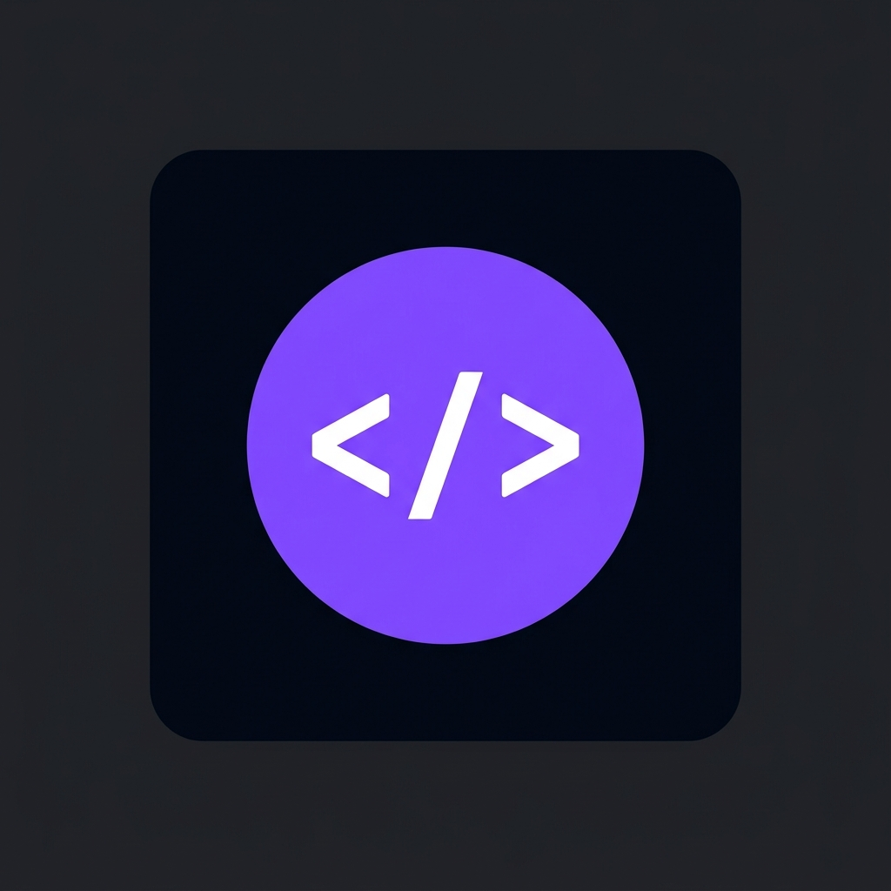

<p align="center">
  
</p>

<h1 align="center">CodeshareLive</h1>

<p align="center">
  <strong>Real-time collaborative code editor — built for developers who ship together.</strong>
</p>

<p align="center">
  <a href="https://codesharelive.vercel.app"></a>
  <br/><br/>
  
  
  
  
  
  
  
</p>

<br/>

<p align="center">
  <em>Stop sharing screenshots. Start sharing <strong>live code</strong>.</em><br/>
  The fastest way to collaborate, pair program, and debug with developers anywhere in the world.
</p>

---

<br/>

## ✨ Why CodeshareLive?

Most code-sharing tools feel like an afterthought — clunky, slow, and disconnected from a real coding experience. **CodeshareLive** was purpose-built from the ground up to feel like you're coding in the same IDE, sitting side by side with your team.

> **Zero signup. Zero installs. Just click a link and code.**

<br/>

## 🎯 Core Features

<table>
  <tr>
    <td width="50%">
      <h3>⚡ Instant Rooms</h3>
      <p>Generate a unique room with one click using UUID-based room IDs. Share the link — anyone who opens it is instantly connected. No accounts, no friction.</p>
    </td>
    <td width="50%">
      <h3>👥 Live Collaboration</h3>
      <p>See every keystroke in real-time powered by Socket.io. Color-coded remote cursors show exactly where each participant is editing — true multiplayer coding.</p>
    </td>
  </tr>
  <tr>
    <td width="50%">
      <h3>🖥️ Monaco Editor</h3>
      <p>The same editor engine that powers VS Code. Full syntax highlighting, IntelliSense-style features, and a familiar keyboard experience across <strong>19 languages</strong>.</p>
    </td>
    <td width="50%">
      <h3>▶️ In-Browser Code Execution</h3>
      <p>Run Python, JavaScript, Java, C/C++, and Go directly from the editor. The sandboxed backend compiler returns output instantly — no local setup required.</p>
    </td>
  </tr>
  <tr>
    <td width="50%">
      <h3>🎨 Interactive Whiteboard</h3>
      <p>Toggle drawing mode to sketch diagrams, annotate code, or brainstorm ideas on a shared canvas overlay — synced in real-time across all participants.</p>
    </td>
    <td width="50%">
      <h3>🔒 Read-Only Mode</h3>
      <p>Lock the editor with a single toggle to prevent accidental edits during reviews, presentations, or interviews. Control stays with the host.</p>
    </td>
  </tr>
  <tr>
    <td width="50%">
      <h3>🌙 Dark / Light Themes</h3>
      <p>System-aware theme switching with smooth transitions. Your eyes will thank you during those late-night sessions.</p>
    </td>
    <td width="50%">
      <h3>📥 Download Code</h3>
      <p>Export your work as a properly-named file with the correct extension for the selected language. One click, done.</p>
    </td>
  </tr>
</table>

<br/>

## 🗣️ Supported Languages

<p>
  
  
  
  
  
  
  
  
  
  
  
  
  
  
  
  
  
  
  
</p>

<br/>

## 🏗️ Architecture

```
codesharelive/
├── client/                    # Next.js 16 + React 19 Frontend
│   ├── src/
│   │   ├── app/               # App Router pages & API routes
│   │   │   ├── [roomId]/      # Dynamic room routes
│   │   │   ├── about/         # About page
│   │   │   ├── blog/          # Blog
│   │   │   ├── changelog/     # Changelog
│   │   │   ├── contact/       # Contact form
│   │   │   ├── faq/           # FAQ
│   │   │   ├── privacy-policy/
│   │   │   ├── terms/         # Terms of Service
│   │   │   └── templates/     # Code templates
│   │   └── components/
│   │       ├── Editor.js       # Monaco + Socket.io + Canvas
│   │       ├── Header.js       # Navigation bar
│   │       ├── Footer.js       # Site footer
│   │       ├── ThemeProvider.js # Dark/light theme context
│   │       └── home/           # Landing page components
│   │           ├── AnimatedContainer.js
│   │           ├── FeaturesDetail.js
│   │           ├── HeroBackground.js
│   │           ├── JoinForm.js
│   │           └── MockEditor.js
│   └── package.json
│
├── server/                    # Express 5 + Socket.io Backend
│   └── src/
│       └── index.js           # WebSocket hub + Compilex API
│
└── README.md
```

<br/>

## 🛠️ Tech Stack

| Layer | Technology | Purpose |
|:------|:-----------|:--------|
| **Frontend** | Next.js 16, React 19 | Server-side rendering, App Router |
| **Editor** | Monaco Editor (via `@monaco-editor/react`) | VS Code-grade editing |
| **Styling** | Tailwind CSS 4, Framer Motion | Utility-first CSS, animations |
| **Icons** | Lucide React, React Icons | Crisp SVG icon sets |
| **Realtime** | Socket.io 4 (client + server) | WebSocket-based live sync |
| **Backend** | Express 5, Node.js | REST API + WebSocket server |
| **Compiler** | Compilex + child_process | Sandboxed multi-language execution |
| **Deployment** | Vercel (frontend) | Edge-optimized hosting |

<br/>

## 🚀 Quick Start

### Prerequisites

- **Node.js** v18+ recommended
- **npm** (comes with Node.js)

### 1. Clone the repository

```bash
git clone https://github.com/ShubhamV2503/codesharelive.git
cd codesharelive
```

### 2. Start the backend server

```bash
cd server
npm install
node src/index.js
```

> The server starts at **`http://localhost:4000`**

### 3. Start the frontend

Open a new terminal:

```bash
cd client
npm install
npm run dev
```

> The app opens at **`http://localhost:3000`**

### 4. Start collaborating

1. Open **`http://localhost:3000`** in your browser
2. Click **Create Instant Room** to generate a unique workspace
3. Share the URL with anyone — they're instantly connected
4. Select a language, write code, and run it in real-time

<br/>

## 🌍 Use Cases

<table>
  <tr>
    <td align="center" width="33%">
      <h3>💼 Technical Interviews</h3>
      <p>Watch candidates think in real-time. Run their code instantly against test cases. A professional experience that reflects your engineering culture.</p>
    </td>
    <td align="center" width="33%">
      <h3>🎓 Teaching & Mentoring</h3>
      <p>Walk students through code live. Sketch architecture on the whiteboard. Lead shared sessions with up to 20 participants.</p>
    </td>
    <td align="center" width="33%">
      <h3>🤝 Pair Programming</h3>
      <p>Debug together in real-time. See your partner's cursor, edits, and thought process. Ship features faster, together.</p>
    </td>
  </tr>
</table>

<br/>

## 🧬 Environment Variables

Create a `.env.local` file in the `client/` directory:

```env
# Socket server URL (defaults to localhost:4000 if not set)
NEXT_PUBLIC_SOCKET_URL=http://localhost:4000

# App URL for OpenGraph metadata
NEXT_PUBLIC_APP_URL=https://codesharelive.vercel.app

# Google Search Console verification (optional)
NEXT_PUBLIC_GOOGLE_VERIFICATION=your_verification_code
```

<br/>

## 📄 License & Contributing

**This repository and its codebase are proprietary.** All rights reserved.

However, **contributions are welcome!** If you'd like to improve CodeshareLive, here's how:

1. **Fork** the repository
2. **Create a new branch** for your feature or fix (`git checkout -b feature/amazing-feature`)
3. **Make your changes** and commit them (`git commit -m "Add amazing feature"`)
4. **Push** to your fork (`git push origin feature/amazing-feature`)
5. **Open a Pull Request** — describe what you changed and why

Once your PR is reviewed and merged, you'll be added as a **contributor** 🎉

> **Note:** By submitting a PR, you agree that your contributions will be licensed under the same terms as this project.

<br/>

---

<p align="center">
  <a href="https://github.com/ShubhamV2503/codesharelive">
    
  </a>
</p>
